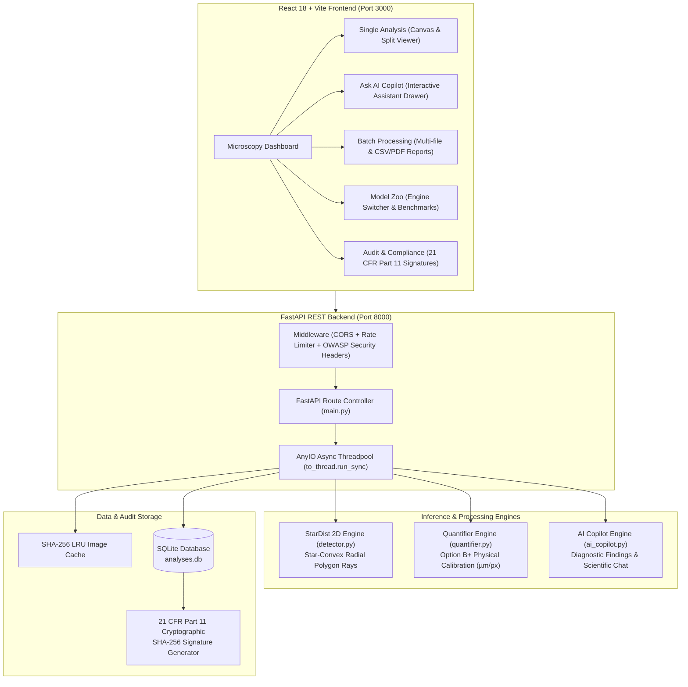

# CellScope — Fluorescence Microscopy Nuclei Segmentation System

**CellScope** is a production-grade, local CPU-deployed biomedical image analysis platform for 2D single-channel nuclear fluorescence microscopy images (DAPI / Hoechst).

---

## 📚 Master Documentation Suite

For complete end-to-end knowledge, architecture deep-dives, training formulas, and developer guides, consult the master documentation suite:

1. 📖 **[Guide 1: Project Vision & Real-World Use Cases](file:///d:/cellscope/docs/01_project_vision_and_usecases.md)** — *Domain background, biological problem, real-world oncology/pharmacology use cases, and uniqueness.*
2. 🏗️ **[Guide 2: Architecture & Tech Stack Justification](file:///d:/cellscope/docs/02_architecture_and_tech_stack_justification.md)** — *Why StarDist 2D vs YOLO/SAM, FastAPI vs Flask, React+Vite vs Next.js, SQLite vs Postgres.*
3. 🧪 **[Guide 3: ML Training, Benchmarking & Accuracy](file:///d:/cellscope/docs/03_ml_training_benchmarking_and_accuracy.md)** — *BBBC039 dataset split, IoU/AP50/F1 math formulas, 50x vectorized IoU acceleration, and model benchmarks.*
4. 🛠️ **[Guide 4: Engineering Challenges & Solutions](file:///d:/cellscope/docs/04_engineering_challenges_and_solutions.md)** — *Real-world bugs faced (float32 array locks, PowerShell execution policy, HMR caching) and technical fixes.*
5. 🎓 **[Guide 5: Developer Onboarding & Mastery Guide](file:///d:/cellscope/docs/05_developer_onboarding_and_mastery_guide.md)** — *Codebase tree map, local setup steps, and developer extension recipes.*
6. 🎯 **[Guide 6: Technical Interview Prep & System Design Q&A](file:///d:/cellscope/docs/06_interview_prep_and_system_design_qa.md)** — *Elevator pitch, technical Q&A, ML/CV math questions, backend system design, & 1M images/day cloud scaling.*
7. 🚀 **[Guide 7: Deployment, Docker, CI/CD & Security](file:///d:/cellscope/docs/07_deployment_cicd_and_security.md)** — *Multi-stage Dockerfile, docker-compose, GitHub Actions CI pipeline, NGINX setup, & OWASP security.*

---

## Key Features

- **StarDist 2D Instance Segmentation:** Accurate nuclear boundary detection with radial polygon rays.
- **Option B+ Physical Calibration:** Auto-reads physical pixel size from OME-TIFF metadata, supports explicit user override with confirmation, or safely falls back to pixel units (`px²`).
- **Cellpose 3.x Baseline:** Benchmarked against Cellpose `nuclei` baseline on official Broad BBBC039 validation split.
- **Empirical Engine Selection:** Benchmarks native TensorFlow vs ONNX Runtime (latency, peak RAM, count match, AP delta) before setting production path.
- **Scientific Leakage Protection:** BBBC039 official test split is evaluated exactly ONCE in `final_eval.py` after champion model selection.
- **FastAPI REST Backend:** Async thread offload (`anyio.to_thread.run_sync`), SHA-256 LRU cache, in-memory rate limiting, OWASP security headers, SQLite audit DB, and JSON structured logging.
- **React Microscopy Analysis Dashboard:** Dark scientific UI with interactive before/after split viewer, instance canvas hover tooltips, cell area histogram, and audit log history.

---

## System Architecture



### Module Component Breakdown

```
├── Dataset: Broad Institute BBBC039v1 (CC0 license)
├── MLOps Pipeline:
│   ├── download_data.py   → BBBC039 direct download (no auth)
│   ├── preprocess.py      → Normalization + official BBBC039 splits
│   ├── benchmark.py       → Pretrained StarDist vs Cellpose (Val split)
│   ├── gate.py            → Acceptance matrix evaluation + fine-tune trigger
│   ├── train.py           → StarDist 2D fine-tuning (Train + Val only)
│   ├── final_eval.py      → ONE-TIME official test set evaluation
│   └── benchmark_onnx.py  → Native TF vs ONNX Runtime benchmark
├── Backend (FastAPI + SQLite + StarDist + ONNX Runtime):
│   ├── detector.py        → Model singleton + overlay renderer
│   ├── quantifier.py      → Per-cell morphology & calibration logic
│   ├── database.py        → SQLite audit log store
│   └── utils/             → Calibration (Option B+), SHA-256 cache, JSON log
└── Frontend (React 18 + Vite + TypeScript + Recharts):
    ├── ImageUploader      → Drag-drop OME-TIFF/TIFF/PNG + scale input
    ├── CellMetricsPanel   → Nuclei count, mean area, circularity, density
    ├── SegmentationOverlay→ Interactive canvas overlay & instance masks
    ├── SplitViewer        → Clip-path before/after slider
    ├── HistogramPanel     → Per-cell area distribution
    └── AuditLogTable      → Historic analysis runs
```

---

## Quick Start (Local Setup)

### 1. Environment Setup
```bash
# Create conda environment
conda env create -f environment.yml
conda activate cellscope

# Check environment compatibility
python -c "from stardist.models import StarDist2D; StarDist2D.from_pretrained('2D_versatile_fluo')"
python -c "from cellpose import models; m = models.Cellpose(gpu=False, model_type='nuclei')"
```

### 2. Run MLOps Data & Benchmark Pipeline
```bash
# Download BBBC039 (CC0, no auth required)
python mlops/download_data.py

# Preprocess & load official partitions
python mlops/preprocess.py

# Benchmark pretrained StarDist vs Cellpose on validation split
python mlops/benchmark.py

# Evaluate acceptance gate (invokes fine-tuning only if needed)
python mlops/gate.py

# Final one-time test set evaluation
python mlops/final_eval.py
```

### 3. Run Local FastAPI Backend
```bash
uvicorn backend.main:app --reload --port 8000
```
API Documentation: [http://127.0.0.1:8000/docs](http://127.0.0.1:8000/docs)

### 4. Run React Dashboard
```bash
cd frontend
npm install
npm run dev
```
Dashboard UI: [http://localhost:3000](http://localhost:3000)

---

## Running Automated Tests
```bash
pytest backend/tests/ -v
```

---

## License
- **BBBC039 Dataset:** CC0 (Public Domain)
- **CellScope Code:** MIT License
