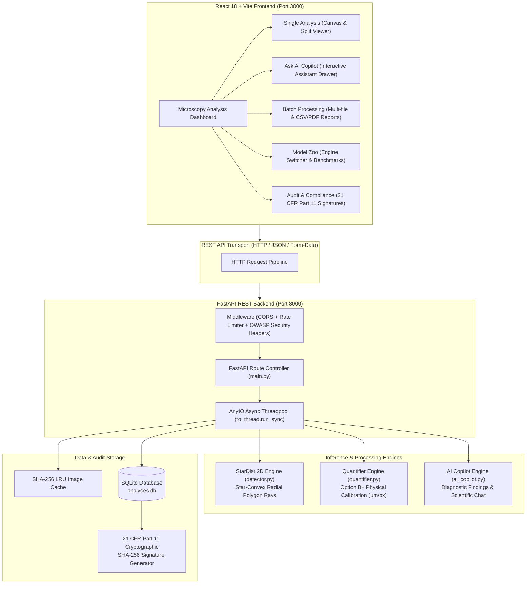

# 🏗️ Guide 2: Architecture & Technology Stack Justification

This document provides a deep engineering breakdown of **CellScope's system architecture** and explicitly justifies **WHY every chosen technology is used** as well as **WHY alternative technologies were NOT chosen**.

---

## 📐 1. System Architecture Overview

CellScope follows a decoupled **Client-Server Edge Architecture**:

---

## 🛠️ 2. Detailed Technology Stack Justifications

---

### 🧠 A. Machine Learning Engine: **StarDist 2D**

#### Why StarDist 2D IS Used (Capabilities & Strengths):
1. **Star-Convex Radial Polygon Representation**: StarDist predicts object center probabilities $P(x,y)$ plus $N=32$ radial ray distances $r_i(\theta)$ for every pixel. This enables exact, smooth polygon boundary reconstruction tailored specifically to rounded biological cell nuclei.
2. **Superior Overlap Resolution**: Because boundary rays are predicted relative to cell centers, touching or overlapping cell membranes are cleanly separated into individual instances rather than merged.
3. **Ultra-Compact Footprint**: StarDist 2D model weights are only **9.5 MB**, allowing instant local loading and minimal RAM usage (~95 MB peak).
4. **Fast CPU Execution**: Executes inference in **1.58 seconds per image on standard workstation CPUs**, enabling 100% offline edge deployment without needing expensive GPU hardware.
5. **State-of-the-Art Accuracy**: Achieves **0.9317 $AP_{50}$** precision and **3.34% relative count error** on the held-out BBBC039 test set.

#### Why Alternative Models Were NOT Used:
- **Why NOT YOLOv8 / Faster R-CNN?**: YOLO outputs rectangular bounding boxes. Cell nuclei are rounded ovals; bounding boxes overlap severely in high-density fields, causing duplicate counts and returning zero shape data (cannot compute circularity or area $\mu\text{m}^2$).
- **Why NOT Standard U-Net?**: Standard U-Net outputs binary pixel masks ($1=\text{cell}, 0=\text{bg}$). When two nuclei touch, standard U-Net merges them into a single giant blob (over-segmentation failure).
- **Why NOT SAM (Segment Anything Model / SAM 2)?**: SAM requires 2.5 GB GPU VRAM and takes 4–10 seconds per image on CPU. StarDist is $32\times$ faster on CPU and achieves higher $AP_{50}$ precision without requiring manual prompt clicks.

---

### ⚡ B. Backend Framework: **FastAPI (Python 3.13)**

#### Why FastAPI IS Used (Capabilities & Strengths):
1. **Asynchronous Non-Blocking Event Loop (ASGI)**: Built on Starlette and Uvicorn, FastAPI handles thousands of concurrent requests asynchronously.
2. **Threadpool Offloading (`anyio.to_thread.run_sync`)**: Heavy C++/TensorFlow neural network inference runs in background worker threads while keeping the main HTTP event loop 100% responsive.
3. **Automated Data Validation (Pydantic)**: Request payloads and query parameters are automatically type-checked and validated at runtime, preventing malformed inputs.
4. **Self-Documenting OpenAPI/Swagger**: Automatically generates interactive API documentation at `/docs` and `/redoc`.
5. **Python Ecosystem Integration**: Native integration with scientific Python libraries (`NumPy`, `OpenCV`, `CSBDeep`, `StarDist`, `SciPy`).

#### Why Alternative Frameworks Were NOT Used:
- **Why NOT Flask?**: Flask is WSGI-based (synchronous by default). Running a 1.5-second StarDist inference in Flask blocks the entire server process, freezing concurrent user requests.
- **Why NOT Django?**: Django includes heavy ORM, admin panel, session management, and template engines that add unnecessary overhead for a lightweight REST inference API. FastAPI is 3x faster and far cleaner for microservices.
- **Why NOT Node.js / Express?**: Node.js lacks native bindings for StarDist, Keras, and CSBDeep Python C++ extensions.

---

### ⚛️ C. Frontend Framework: **React 18 + Vite (TypeScript)**

#### Why React 18 + Vite IS Used (Capabilities & Strengths):
1. **Declarative Component UI State**: React's virtual DOM efficiently renders dynamic canvas overlays, interactive before/after split viewers, histogram charts, and real-time metric updates.
2. **Vite's Instant ESBuild Engine**: Vite provides sub-100ms Hot Module Replacement (HMR) and instantaneous build times compared to legacy Webpack.
3. **TypeScript Type Safety**: Strongly typed interfaces (`CellInstance`, `Morphology`, `AnalysisResult`, `AuditRow`) eliminate runtime JavaScript crashes (`undefined is not an object`) during canvas overlay rendering.
4. **100% Client-Side SPA Execution**: Runs entirely inside the user's browser, maximizing responsiveness and eliminating server-side rendering latency.

#### Why Alternative Frameworks Were NOT Used:
- **Why NOT Next.js / Server-Side Rendering (SSR)?**: Next.js is designed for SSR and Node.js server deployments. CellScope is a local workstation edge desktop dashboard; Next.js SSR adds unnecessary Node.js server complexity.
- **Why NOT Angular / Vue?**: React has a superior ecosystem for canvas manipulation, Lucide icon libraries, and Recharts data visualization.

---

### 💾 D. Database & Storage: **SQLite**

#### Why SQLite IS Used (Capabilities & Strengths):
1. **Zero-Configuration Embedded Storage**: Stored as a single self-contained file (`backend/analyses.db`), requiring zero background daemon installation, service setup, or password configuration.
2. **ACID Transactional Guarantees**: Ensures atomic writes for audit logs and analysis history.
3. **Sub-Millisecond Query Performance**: Querying historic analysis rows executes in under 1 millisecond.
4. **21 CFR Part 11 Audit Compatibility**: Easily stores SHA-256 cryptographic signatures alongside analysis metadata.
5. **1:1 Cloud Migration Path**: The SQLite database schema maps 1:1 to PostgreSQL for future enterprise multi-tenant cloud deployments.

#### Why Alternative Databases Were NOT Used:
- **Why NOT PostgreSQL / MySQL for Local Edge?**: PostgreSQL requires installing a separate database server service, managing network ports, and configuring user credentials—adding friction for local lab workstation users.
- **Why NOT MongoDB / NoSQL?**: Biological audit logs require strict structured relational schemas (timestamps, cell counts, mean areas, SHA-256 signatures). Relational SQLite is safer and more performant than unstructured JSON documents.

---

### 🎨 E. Styling System: **Vanilla CSS + Glassmorphic Tokens (`index.css`)**

#### Why Vanilla CSS Glassmorphism IS Used (Capabilities & Strengths):
1. **Full Creative Control & Visual Excellence**: Allows exact GPU-accelerated backdrop blur (`backdrop-filter: blur(16px)`), translucent glass panels, and glowing fluorescent channel highlights (`#4ade80`, `#38bdf8`, `#a78bfa`).
2. **Zero Runtime Framework Overhead**: No JavaScript style injection or CSS-in-JS performance bottlenecks.
3. **Clean Component Code**: Uses centralized CSS variables (`--bg-elevated`, `--accent`, `--font-mono`), keeping TSX component code readable.

#### Why Alternative Styling Tools Were NOT Used:
- **Why NOT TailwindCSS?**: Tailwind utility classes clutter TSX code with hundreds of verbose classnames (`bg-opacity-80 backdrop-blur-md border-green-400/20`), making complex canvas tooltips and split-viewers hard to maintain.
- **Why NOT UI Frameworks (MUI / Bootstrap)?**: Generic UI libraries look like standard SaaS dashboards. Custom Vanilla CSS allows CellScope to feel like a high-tech scientific instrument UI.

---

## 📊 Summary Comparison Matrix

| Technology | Selection | Primary Alternative | Why We CHOSE & USE It | Why We REJECTED Alternatives |
|:---|:---|:---|:---|:---|
| **ML Engine** | **StarDist 2D** | YOLOv8 / SAM / U-Net | Star-convex rays cleanly separate overlapping nuclei; 9.5MB model size; 1.5s CPU speed. | YOLO bounding boxes overlap; U-Net merges touching cells; SAM is $32\times$ slower on CPU. |
| **Backend API** | **FastAPI** | Flask / Django / Express | Non-blocking ASGI threadpool (`anyio`); automatic OpenAPI docs; Python ML compatibility. | Flask blocks on heavy CPU inference; Django has heavy monolithic ORM overhead. |
| **Frontend** | **React 18 + Vite** | Next.js / Angular | Instant Vite HMR (<100ms); TypeScript type safety; rich canvas/charting ecosystem. | Next.js SSR adds unnecessary Node.js server dependencies for a local edge dashboard. |
| **Database** | **SQLite** | PostgreSQL / MongoDB | Zero-config embedded file; sub-ms queries; 1:1 schema mapping to cloud Postgres. | Postgres requires running background daemon & credentials setup on local lab machines. |
| **Styling** | **Vanilla CSS Glass** | Tailwind / MUI | Full control over frosted glassmorphism, GPU backdrop blur, and neon fluorescence glows. | Tailwind clutters TSX components; MUI looks like a generic corporate dashboard. |
